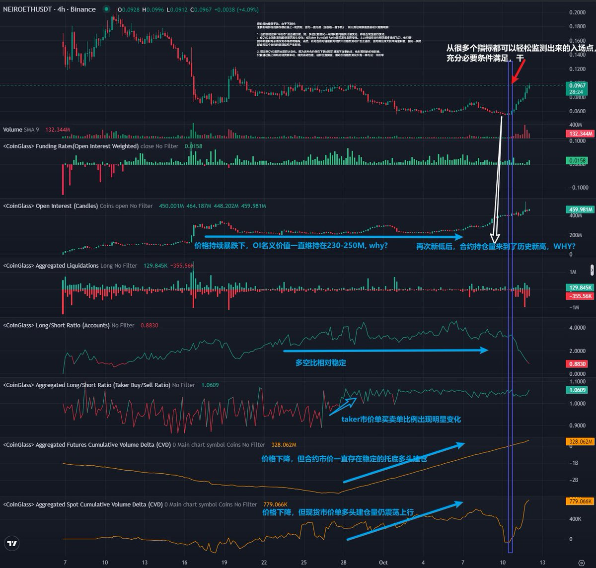

# 合約現貨 CVD 分析：識別莊家控盤與市場結構變化

> **來源**: [@banezh](https://x.com/banezh/status/1844833998679531832)
>
> **日期**: Fri Oct 11 20:14:35 +0000 2024
>
> **標籤**: `市場微觀結構` `合約分析` `莊家行為`

---

> **來源**: [@banezh (Bane💤)](https://twitter.com/banezh)
> **標籤**: `CVD分析` `合約現貨套利` `莊家控盤` `市場微觀結構` `鏈上數據`

---

## 核心觀點

對於主力控盤率高、喜歡在交易所進行「積極」市值管理的幣種，觀察合約和現貨的交易數據通常比技術分析更有效。

## 案例分析：NEIRO 的控盤手法

以 @NeiroOnEthereum 為例，兩天內暴漲 80%，資金容納量大。其操盤手法非常明顯：

### 下跌時的市場結構特徵

透過觀察 CVD（Cumulative Volume Delta）可發現：

- **主要價格影響**：集中在鏈上 + 現貨側
- **合約側行為**：一直存在穩定的市價單買入托底（但價格仍持續下跌）
- **持倉量變化**：OI 在價格下降中持續升高

## 監控啟動信號的方法

### 1. 合約側「平衡態」是否被打破

監控以下指標的變化：

#### 多空比變化（最常用）
- 觀察一段時間的均值統計量變化
- 判斷是否發生劇烈變動

#### 合約 CVD 趨勢
- 上漲斜率是否發生變化
- 整體趨勢是否改變

#### Taker Buy/Sell Ratio
- 是否發生劇烈變化

### 關鍵邏輯

主力持續在合約側「接飛刀」，這批資金目前處於嚴格虧損狀態。要回本/獲利，必須**改變市場微觀結構**來推動價格變化，使其高於平均建倉價格。

#### 建倉成本估算

可透過「合約 CVD 斜率均勻上漲但價格一直下降」的區間，計算加權平均交易價格，判斷主力這批新資金的建倉成本。

#### 市場結構變化的其他可能

市場結構變化也可能因為：
- 現貨市價劇烈變動導致合約負溢價
- 合約側出現大批單向套利者

無論原因為何，都會對合約的微觀結構產生影響，因此可在出現信號、統計上有顯著獲利機會的時間間隔裡完成建倉。

### 2. 現貨側 CVD 是否出現巨大變化

#### 莊家操作邏輯

這種「合約側在下跌過程只吸籌不做事」的莊家，對籌碼的價格影響只能透過：
- 鏈上操作
- 交易所內現貨側操作

由於現貨流動性差，對價格影響的成本也很低。

#### 價格驅動的唯一方法：市價單

**關鍵常識**：
- 除非你就掛在盤口買 1 賣 1 去和熱錢搏殺
- 否則**限價單永遠不會影響盤口價格**
- **能影響價格的只有市價單**

#### 交易機會

通常來說，市價單的爆砸暴漲都是機會，但需要用自己的腳本去判斷邏輯。爆砸完可能反而是入場點。

## 案例特殊性說明

這個案例之所以看得如此清楚，是因為：

1. **做市團隊水準低**：@NeiroOnEthereum 的主觀做市團隊操作非常明顯
2. **籌碼高度集中**：控制非常集中，容易被看得到數據的人搭便車

### 一般情況的複雜度

通常來說，一個籌碼結構和市場結構複雜的莊幣：
- 主動做市行為會有非常多噪音
- 一些主動做市方法會讓你看不出這些單純的趨勢
- 使用交易數據需要扔進多因子模型進行解構和學習
- 有時效率可能還不如技術分析指標來得高
- 畢竟行為經濟學總是對的
