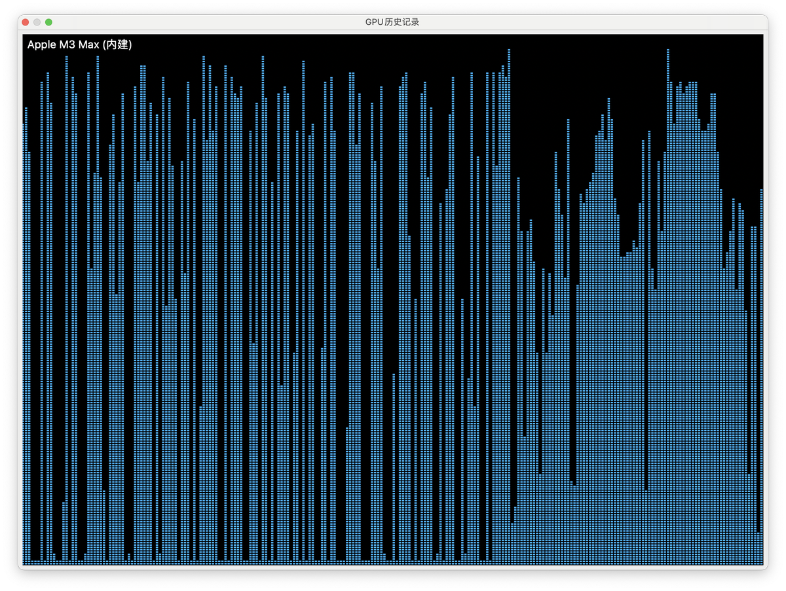

# DePIN 挖礦 GPU 監控技巧與多開策略

> **來源**: [@Btc_Crush](https://x.com/Btc_Crush/status/1842200083384906069)
>
> **日期**: Fri Oct 04 13:48:20 +0000 2024
>
> **標籤**: `GPU監控` `DePIN挖礦` `macOS實用技巧`

---

> **來源**: [@Btc_Crush (夢想成為科學家)](https://x.com/Btc_Crush)
> **日期**: 2026-02-18
> **標籤**: `DePIN` `GPU 挖礦` `macOS` `多開策略`

---

## macOS GPU 監控方法

### 使用活動監視器查看 GPU 使用率

1. 打開「活動監視器」（可在「應用程式」資料夾中的「工具程式」資料夾找到，或使用 Spotlight 搜尋「活動監視器」開啟）
2. 進入「活動監視器」後，點選視窗頂部的「視窗」選單，然後選擇「GPU 歷史記錄」
3. 會出現獨立視窗，顯示當前系統中每個 GPU 的使用情況和歷史記錄

這種方式能直觀地看到 GPU 的即時使用情況。

---

## 實戰數據參考

從早上開始，2 個 SUI 的成本，到當下已獲利 100 多 U。

---

## 常見問題

### 1. 自動點擊程式碼無法複製貼上
（原文未提供解決方案）

### 2. 什麼設備能挖
（原文未詳細說明）

### 3. 如何多開，為什麼要多開
（原文未詳細說明）

### 4. 如何買賣
（原文未詳細說明）

---

## 未解決問題

錢包鏈上卡頓，甚至無法轉帳 SUI
