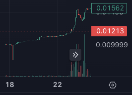
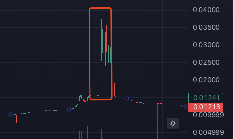
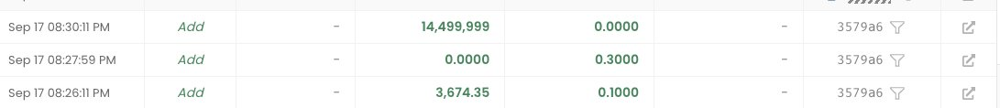
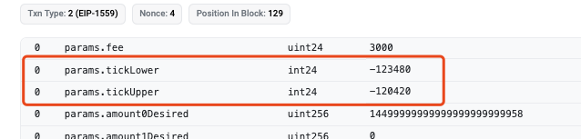

# Uniswap V3 流動性做市的土狗漲幅機制分析

> **來源**: [@cutepanda](https://x.com/cutepanda/status/1838556085432778989)
>
> **日期**: 
>
> **標籤**: `Uniswap V3` `市場微觀結構` `土狗交易策略`

---

> **來源**: [@cutepanda (cutepanda)](https://twitter.com/cutepanda)
> **日期**: 2024-11-xx
> **標籤**: `Uniswap V3` `流動性做市` `土狗` `市場操控` `鏈上交易`

---

## 案例觀察：RALLY 土狗的異常表現

昨晚在鏈上突然出現一個叫 RALLY 的土狗幣，沒有任何資訊，但一直有好幾 E 的大單持續買入。

奇怪的是，雖然池子一直在漲，但初期的價格變動非常非常小。很多人猜測是不是代幣有什麼特殊機制，但實際上代幣是最簡單的代幣，不包含任何機制。這個單純是利用 V3 流動性來控制價格的一個案例。

## 價格走勢分析

大家剛發現的時候可能都是走到下面這段曲線：大概池子從 0.3e 衝到 50e 了，但是價格變化比較小。

然後當價格到了某一個點位，就直接開始爆拉。早期買入的人大概都 2-3 倍離場，最後結束了。

## 做市機制解析

回過頭來分析，可以發現專案方加池子實際上加了三筆：

1. **第一筆**：加了初始流動池子，比較小，但是價格範圍大
2. **第二筆**：eth 的單邊池子
3. **第三筆**：只加了代幣的單邊池子，價格範圍很小

### 價格波動原理

所以大家一開始買入的時候，實際上都是在第三筆這個池子裡。於是價格就在這個單邊池裡進行小範圍波動，這個上漲也類似於一個對數函數，價格變化也很小。

直到突破這個價格後，就走了其他池子的交易，價格變化的區間就拉大了，所以直接會出現爆拉爆砸。

## 歷史案例

實際上去年土狗比較火熱的時候，也經常出現過一兩個這種做市機制的盤子（名字我不記得了），但我有朋友大膽梭哈賺了 10 eth 以上。

就說這個 RALLY，這次其實我看到有很多大佬投了 5e 進去，出來十幾個 eth，也給他們爽翻了。應該的確是有經驗又看得懂的人買進去的。

## 實戰建議

下次遇到這種盤子，建議如下：

### 1. 大膽上倉位

如果合約驗證了安全性、專案靠譜，那麼就大膽**上倉位往裡投**。

因為這種盤子如果你買在最開始的價格波動小的區間，本質上等於你花錢參與了一個預售。然後後面突破價格區間，就等於開盤了，你就可以直接賣出你的籌碼，或者如果覺得更高，那就拿住。

### 2. 最差情況分析

最差的情況，就是他拉上去一波、跌下來，但是他回到的仍然是你買入的那個區間，也不會掉下去那個區間。你可以以接近成本價賣出，只要他不 rug，你正常賣掉不會虧的。

### 3. 不要接盤爆拉

**不要去接突破價格區間的那根綠柱子**，那是早期籌碼的出貨指標。

## 總結

機會很多，但是機會都留給有準備的人。接著學接著練，我們一定能賺大錢！
