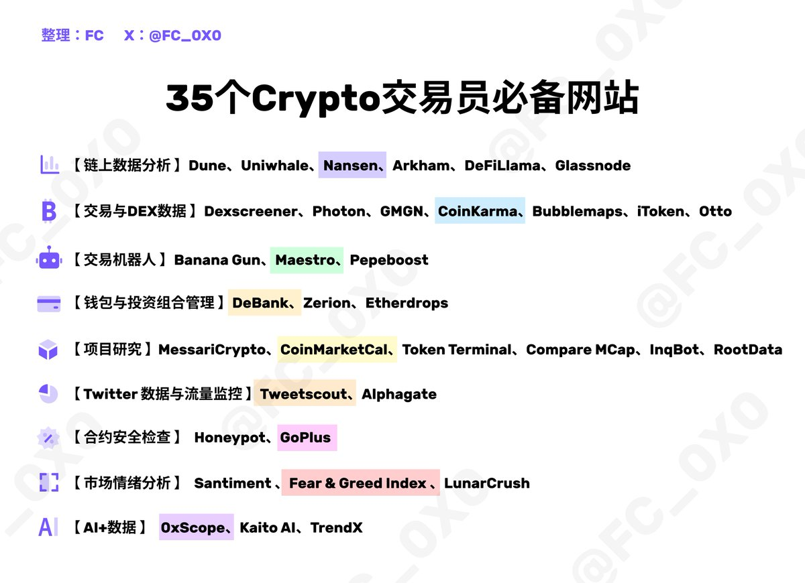

# 加密貨幣交易員必備 35 個網站工具整理

> **來源**: [@FC_0X0](https://x.com/FC_0X0/status/1837382922690855140)
>
> **日期**: Sat Sep 21 06:46:40 +0000 2024
>
> **標籤**: `交易工具` `平台資源` `效率提升`

---

> **來源**: [@FC_0X0 (FC)](https://twitter.com/FC_0X0)
> **日期**: 2026-02-18
> **標籤**: `加密貨幣` `交易工具` `網站資源` `工具整理`

---

## 概述

優秀的交易員都在使用什麼工具？

本文整理了加密貨幣交易員必備的 35 個網站，絕大部分都是免費使用，值得收藏！

**內容啟發來源**：@Rocky_Bitcoin、@Michael_Liu93

---

## 注意事項

由於原始內容只提供了文章的開頭部分（標題和引言），完整的 35 個網站工具清單並未在提供的內容中呈現。

如需完整整理，請提供完整的推文串或文章內容，包含：
- 35 個網站的名稱
- 各網站的用途說明
- 相關的連結或分類資訊

目前僅能確認此文章主題為「加密貨幣交易員必備工具網站整理」，預計包含 35 個推薦網站，且多數免費使用。
