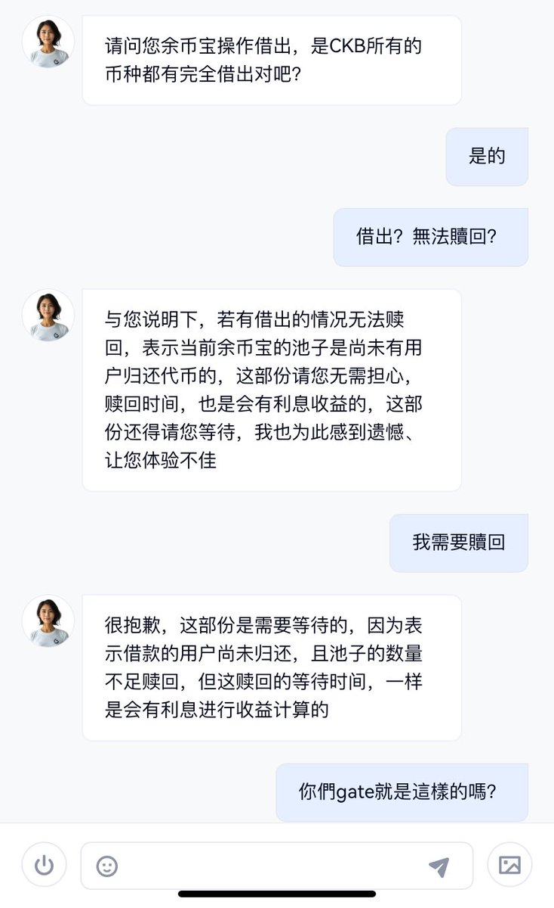

# CEX 流動性管理案例：Upbit 上線 CKB 導致的水位不足問題

> **來源**: [@OwenJin12](https://x.com/OwenJin12/status/1834817411624980929)
>
> **日期**: Sat Sep 14 04:52:14 +0000 2024
>
> **標籤**: `流動性風險` `交易所管理` `市場微觀結構`

---

> **來源**: [@OwenJin12 (Owen.btc 🟧)](https://twitter.com/OwenJin12)
> **日期**: 2025-02-18
> **標籤**: `CEX` `流動性管理` `Upbit` `CKB` `套利`

---

## 事件背景

Upbit 上線 $CKB 後出現水位不足問題，這是一個典型的 CEX 流動性管理案例，類似於銀行擠兌，最終導致每個交易所的價格不一樣。

## 具體情況

Gate 交易所的 $CKB 被借空了，反映出中心化交易所在熱門幣種上線時可能面臨的流動性危機。

## 延伸思考

如果 BTC 在未來某一天被傳統金融機構買光借空了，也會面臨一樣的問題。這個案例揭示了中心化交易所流動性管理的脆弱性，當大量用戶同時提現或交易時，可能會出現類似傳統金融機構擠兌的現象，導致不同交易所之間出現價差套利機會。
