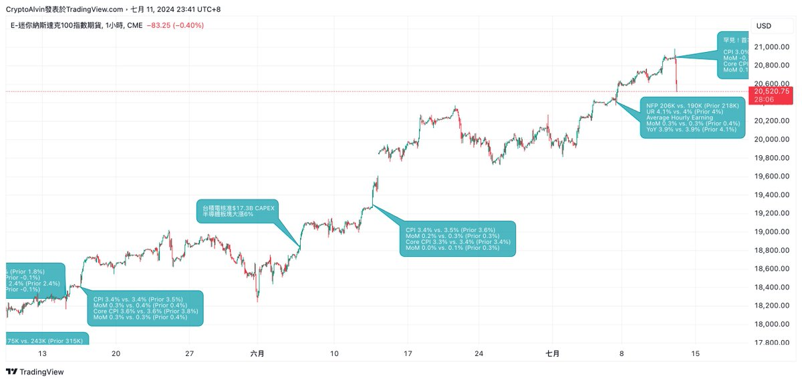
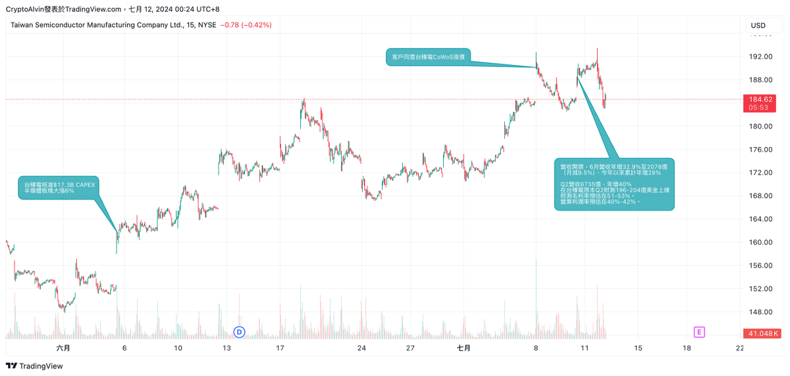
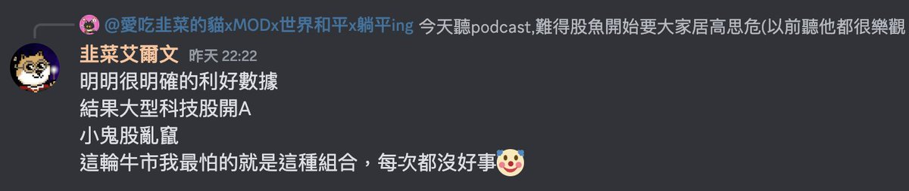

# 美股趨勢轉折徵兆：從漲停到寬幅震盪

> **來源**: [@AlvinWu_TW](https://x.com/AlvinWu_TW/status/1811442111163908452)
>
> **日期**: 
>
> **標籤**: `趨勢轉折` `風險管理` `市場週期`

---

> **來源**: [@AlvinWu_TW (CryptoAlvin)](https://twitter.com/AlvinWu_TW)
> **日期**: 2024-07-12
> **標籤**: `美股` `趨勢轉折` `TSM` `NVDA` `減倉策略`

---

## 市場節奏加速

原本內心是一直預期八月才會開始上演鬼故事序幕、九月才會來個大修正，但市場似乎節奏加速了。

## 總經面異常訊號

過往三個月的 CPI 低於預期都是大漲伺候，唯獨這一次是期貨拉漲之後，股市開盤就一路往下灌。

## 個股利多不漲現象

個股方面，拿 $TSM 來舉例，因為他的走法最明顯：

以前有利好的時候還可以一路漲，這一次則是開了兩次利好，結果都是盤前狂漲、當天開盤（或隔天開盤）之後就被瘋狂拋售，已經開始有**利多不漲**的現象。

單純論這一次的牛市經驗，每當這種事情發生時，最後的結果都不會太好。

## 未來關鍵催化劑

1. **下禮拜四 7/18 的台積電法說會**
2. **下個月 8/15 的 $NVDA 財報開獎**

## 操作策略調整

### 預期走法

如果這邊真的是趨勢轉折處，那通常會先上演**寬幅震盪**的走法。例如去年同一時間就在兩個月內多次上下 10% 抽差，換句話說未來還會有調節倉位的機會。

### 具體做法

- **無槓桿者**：如果你跟我一樣沒有開槓，那就還不必擔心，再多觀察幾天
- **思維轉換**：
  - **以前**：盤勢拉回就 long only
  - **現在**：盤勢上漲就 reduce only
  - **現金水位要開始拉高了**
