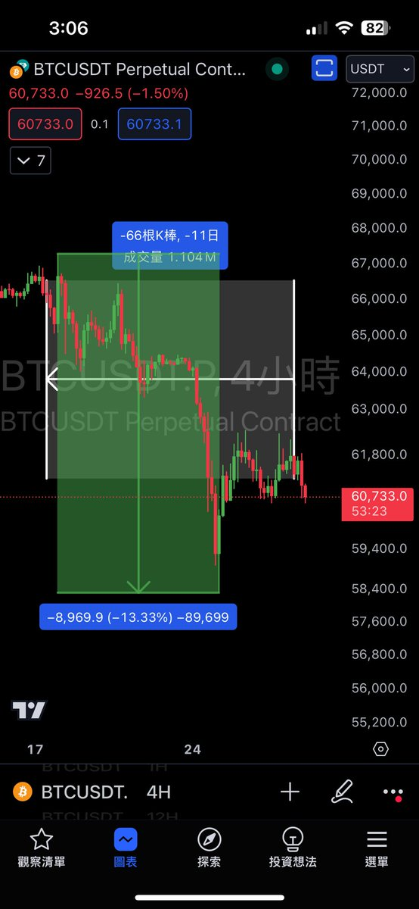

# 期權持單風險管理：陰包陽形態與賣權策略

> **來源**: [@Wayne145591](https://x.com/Wayne145591/status/1806766869216710812) | [原文連結](https://twitter.com/Wayne145591/status/1806766869216710812/photo/1)
>
> **日期**: Fri Jun 28 19:09:24 +0000 2024
>
> **標籤**: `期權交易` `技術分析` `風險管理`

---

> **來源**: [@Wayne145591 (Waynecoin)](https://twitter.com/Wayne145591)
> **日期**: 2026-02-18
> **標籤**: `期權` `風險管理` `賣權策略` `技術分析`

---

## 期權持單風險判斷方法

教大家一個判斷方式，這個是我自己的判斷方式。

## 基本原理

價格上漲後必有回撤，而下跌的末尾必出陰包陽。

## 持單時間參數

我們持單的期權是 7-21 天，平均持單時間是 11 天，共 66 根四小時 K 棒。

## Sell Call 開倉判斷法則

當下跌過程中出現陰包陽，而想開 sell call 時：

1. 先將陰線那根作為 1，往前數至 66 根
2. 檢查這段期間的跌幅是否有大於 10%
3. 如果跌幅大於 10%，那也最好先別開 sell call

