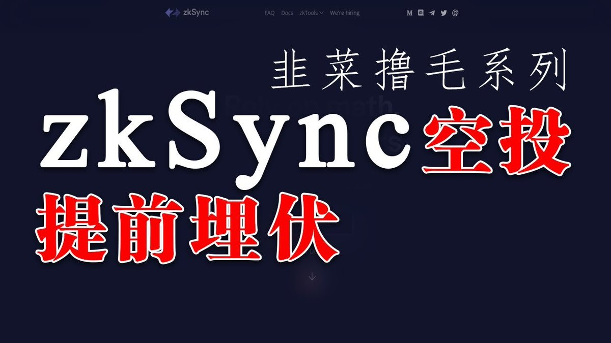
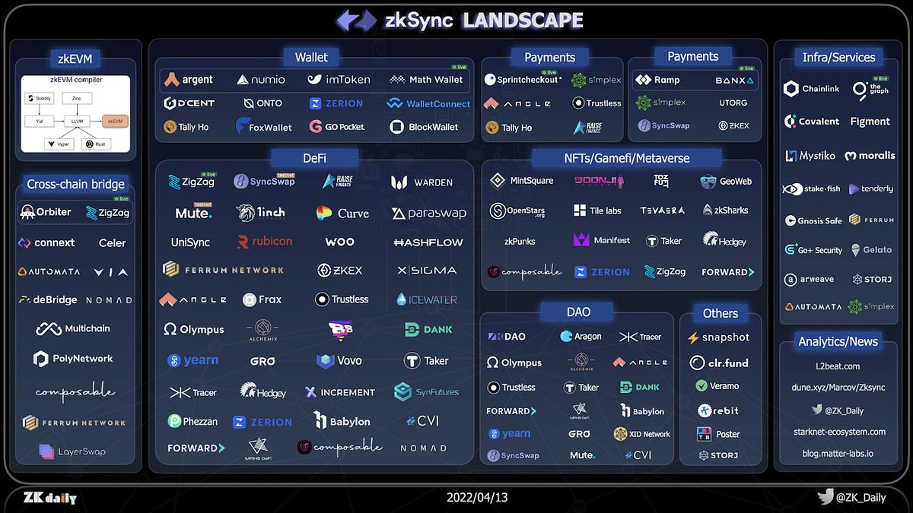
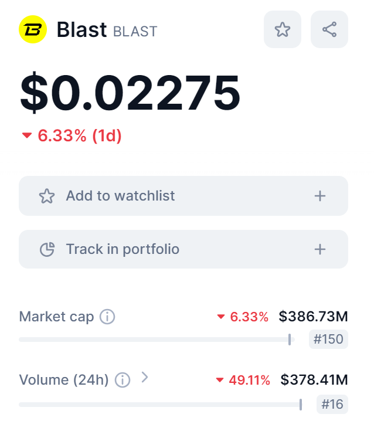

# 空投機制設計實戰：以終為始的項目方套現邏輯

> **來源**: [@thecryptoskanda](https://x.com/thecryptoskanda/status/1806633063763595438)
>
> **日期**: Fri Jun 28 10:17:42 +0000 2024
>
> **標籤**: `空投策略` `項目融資` `風險管理`

---






## 項目方空投的根本目的

項目方進行空投的核心目標是**最大化團隊賣幣利潤**。空投本質上是為了後期賣幣而付出的市場營銷成本，主要目的包括：

- **提升傳播度**：空投活動讓 KOL 有無風險傳播的抓手，降低用戶上車門檻，獲取數據以便與 VC 和交易所談判
- **解決合規問題**：直接 ICO/IEO 在很多國家不合規，空投是變相的首發方式，可以上大型交易所獲得充足流動性
- **規避交易所條款限制**：交易所會嚴格監督代幣解鎖和分配，項目方無法在上幣初期直接套現，需要通過空投藏籌碼、老鼠倉等方式獲得更多開盤套現機會

## 撸毛參與者的心態

撸毛參與者的本質是「你讓我辦事，你給我發錢」的 100% 因果 POW 思維。可以用礦機分紅盤的邏輯理解：**信任成本、沉沒成本、回本週期**。

這些人中絕大多數不會成為未來的二級交易者，就像 BTC 礦工不會二級市價囤幣一樣。

## 空投設計的三個階段

### 一、搞定領投前

此時項目缺乏背書，用戶信任成本較高，應採用：

**策略要點**：
- 採用 **0 成本或低成本、簡單但重複** 的活動形式（提高時間沉沒成本）
- 這個階段不惜一切做數據，無需考慮後續空投兌現問題

**數據類型選擇**（四種）：TVL、交易量、DAU、協議收入

**具體操作**：
- 選擇沒有單位成本且最容易刷上去的形式（一般排除協議收入）
- 如測試網領水交易（刷交易量）、註冊點點點（刷 DAU）等
- 將任務進程統一到同一個顯示標準上（如 Linea 的 LXP、Initia 的遊戲式積分）
- 只有可視化才能讓用戶覺得付出能獲得反饋，形成沉沒成本概念

**傳播策略**：
- 不用在意積分發行是否合理，這與最後空投無關
- 不要對多帳號設置任何門檻和限制，應盡可能讓腳本製作簡單
- 找英語系粉絲量大的空投教程類大 V，花錢或給額度讓其反覆發測試網教程
- 華語撸毛人會很快跟進

**案例**：Blast 上來就讓存錢給利息，是因為 Blur 已經建立初始信任，且在熊市直接上 TVL 是成本最低路徑。

### 二、搞定交易所前

交易所的重點有三：**合規、新用戶、新買盤**

**核心策略**：
- **合規**：找好白手套（生態），去做主體項目因合規風險不方便做但為了用戶增長必須做的事情
- **新用戶、新買盤**：必須讓用戶花錢，產生「協議收入」（這是大所的趨勢）
- 做拆分盤，讓用戶盡可能多花錢，抬高他們未來的籌碼成本

**為上幣老鼠倉和最終空投成本做準備**：

1. **增加活動維度**：讓活動覆蓋的資產標的或交易行為盡可能多
   - 如某兩個主網之間的跨鏈（W 和 ZRO）
   - 購買某個 NFT（熊貓王）
   - 添加過 Dex LP（ZKSYNC）等
   - 維度越多，後續空投可操作空間越大

2. **對外親疏不辨**：不可讓外界產生某個項目是官方支持「親兒子」的想法
   - 避免同類項目之間交互量出現剪刀差
   - 需要相對平均，才能渾水摸魚

3. **對內明確陣營**：真正的親兒子是母項目方可以從中直接或間接吃到客損的項目
   - 後續實際發放空投時應給予傾斜
   - 確保「盈虧可控」

**案例**：ZKSYNC 中即使原生 DeFi 基建，也很難分辨與 Matter Labs 之間的親疏遠近關係，導致為了衝鏈上交易量，大量項目都有交易流量。最終被 ZKSYNC 官方混進去不少歸零土狗項目拿到了空投，等於又吃又拿。多維度的活動也最終成功讓 ZKSYNC 合理化了大量老鼠倉空投。

### 三、TGE 前

真正的算帳時刻。在確定交易所到 TGE 前，積分可以無限增發，空投由項目方說了算。但確定後，需要確定積分和空投間的勾稽關係（完全不用成比例，只需相關且有理有據）。

#### 以終為始的核心公式

撸毛人是 POW 心態，別指望他們二級買幣。目標是上所套現，優先級是好的二級表現。因此所有實際撥出的空投一律視為拋壓，而**拋壓不能大於首日的交易所買盤**。

**核心公式**：
```
首日交易所總買盤 ≥ 預計首日均價 × (TGE 解鎖 + TGE 實發空投)
```

**案例計算**：
假設某項目當前輪次估值 8000 萬，預計 TGE 時估值 2 億，如果 VC 等都沒有解鎖，首發三個二線所總買盤預計 300 萬，那麼該項目 TGE 首日的實發空投（實際發給不可控的非項目方的代幣）上限不能超過 1.5%。

**Blast 案例分析**：
- 初始釋放為 17%（170 億）
- 上線主力所是 Upbit、Bithumb 和 Bybit
- 根據同樣上幣策略的 Taiko 頭兩日表現，預估 3-5 億美元交易量合理
- 假設僅 2 成為二級對二級的換手，純買盤約 3 億
- 當前約 0.024 左右（FDV 24 億）非常合理，並不是「低估」

#### 倒推計算邏輯

當知道首日實發空投上限後，加上老鼠倉佔比，即可倒推出：
- 首日名義空投分發上限（對外公告頭一天分發並解鎖的空投數）

與 tokenomics 公佈的空投佔比差額部分，需要通過以下手段解決：
- 🔒 鎖倉
- 🧙‍♀️ 反女巫
- 🚫 定向降低或取消某個活動維度的佔比

#### 調整目標的平衡三要素

以上調整的目標應該是平衡以下三者：
1. **最大化單位撸毛的折算 FDV**（撸毛成本相當於多少 FDV 買幣）
2. **保持單號收益在社區不 FUD 的範圍內**（不造成大面積虧損反撸）
3. **最大化老鼠倉持有**

⚖️ **在無法妥善平衡的情況下**：
- 優先保證最大數量有影響力帳號的情緒穩定
- 對超大戶和超小戶開刀（盡可能少得罪人以保持二級輿論正面）
- 超大戶可以理性逐個解決，超小戶根本沒有市場發聲可能
- 不要像 L0 和 ZKSYNC 那樣得罪市場中聲量最大的多數

## 總結

空投活動的根本目的在於：
1. 獲取數據以綁定 VC 和上所資源
2. 形成初始籌碼結構
3. 完成老鼠倉

根據募資、上所階段的不同，採取：
- **最大化 0 成本數據**
- **多維度增加用戶沉沒成本**

在 TGE 前，根據待上所首日買盤情況：
1. 確定首日實際空投撥出量
2. 倒推出名義空投撥出量
3. 制定鎖倉策略
4. 制定反女巫策略
5. 制定不同維度分發策略

**空投 PUA 是長跑，對獵物如此，對獵人也一樣。項目方永遠要記得自己為什麼出發，以終為始。**
