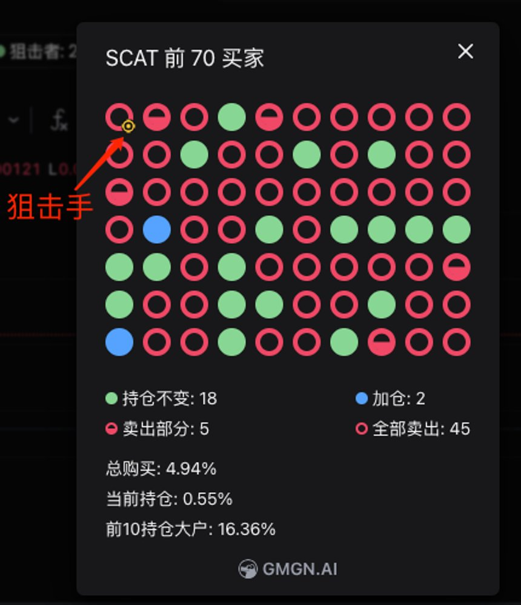
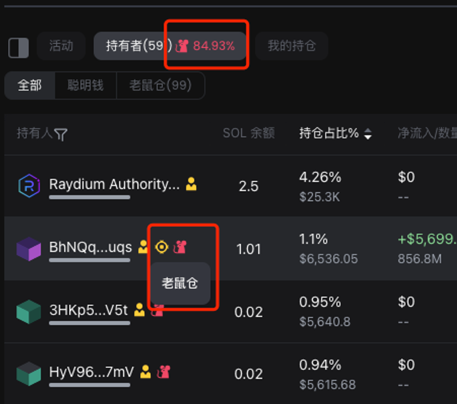
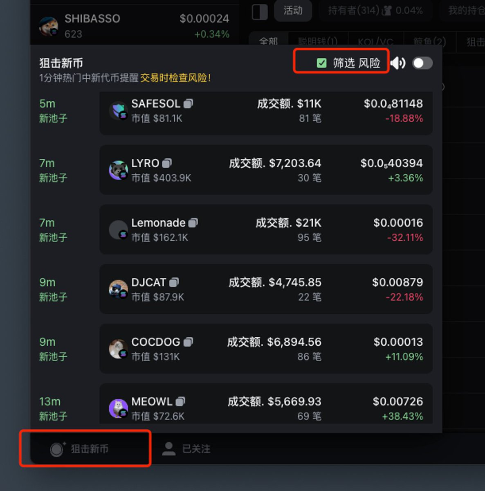
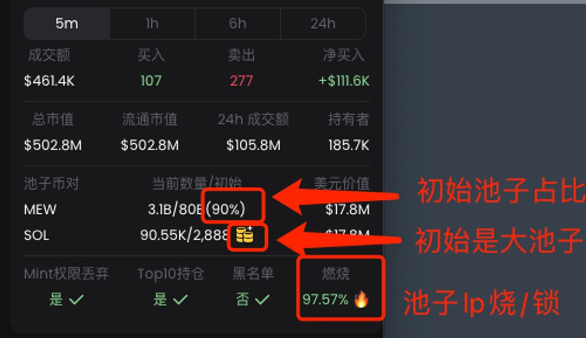

# GMGN 全鏈 Meme 交易工具使用指南

> **來源**: [@xixikawaii](https://x.com/xixikawaii/status/1796523541363662933) | [原文連結](https://t.me/xixi_callchat)
>
> **日期**: Fri May 31 12:46:04 +0000 2024
>
> **標籤**: `Meme 交易` `交易工具` `風險評估`

---

> **來源**: [@xixikawaii](https://twitter.com/xixikawaii)
> **標籤**: `GMGN` `Meme 交易` `SOL` `ETH` `鏈上工具`

---

## 工具概述

GMGN（@gmgnai）是全鏈 Meme 交易工具，支援 SOL 和 ETH 鏈，可透過網站和 TG 訪問。

### 產品優勢
- 自動 gas 和滑點設定
- Bot 獨享提交節點
- 網頁端與 Telegram Bot 雙管道

### 產品連結
- **SOL 鏈**: https://gmgn.ai
- **ETH 鏈**: https://gmgn.ai  
- **Telegram Bot**: @gmgnaibot

---

## 核心功能

### 前 70 買家持倉分析
追蹤早期買家（狙擊手）的出貨情況，透過持倉變化判斷代幣健康度。

### 實時老鼠倉占比顯示
即時監控內部持倉占比，識別潛在的內幕交易風險。

---

## 新手提高勝率策略

### 新幣狙擊流程

1. **監控新幣上線**  
   盯著網頁（https://gmgn.ai）左下角的「新幣狙擊」區塊，發現新幣時點進去查看

2. **檢查燃燒機制 🔥**  
   **關鍵指標**：沒有燃燒（burn）的代幣，有 60% 的機率是 rug pull（跑路）

   > 燃燒機制是判斷項目方誠意的重要指標，沒燃燒不代表百分百會跑路，但風險顯著提高

---

## 頻道資源

作者頻道（https://t.me/xixi_callchat）已對接 GMGN Bot，可直接體驗工具功能。

### 頻道提供的工具連結
- Axiom 全鏈 Meme 掃鏈平台：https://axiom.trade
- GMGN 全鏈 Meme 機器人（App）：t.me/gmgnaibot
- SOL Meme 交易機器人（Tg）：t.me/dogeebot_bot
