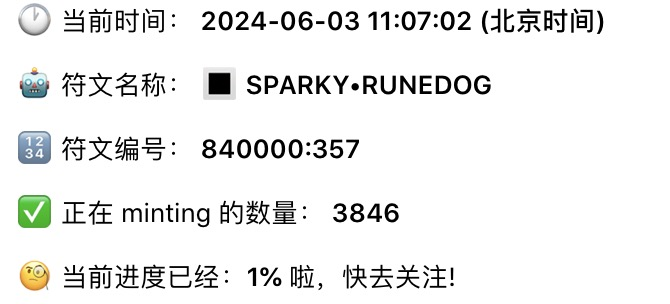

# Runes 打新套利進階策略：小資金與大資金的差異化玩法

> **來源**: [@0xquqi](https://x.com/0xquqi/status/1797495219983900753)
>
> **日期**: Mon Jun 03 05:07:10 +0000 2024
>
> **標籤**: `Runes打新` `套利策略` `資金管理`

---

## 核心思路

在 Runes 打新與搬磚套利中，如何根據資金規模制定差異化策略，以及如何正確看待「賣飛」這件事。

## 市場現況觀察

打新在經歷了半天的熊市之後，鏈上再次活躍了起來。成本 50 刀/組，開盤掛 300 刀/一組秒被掃的這種離譜情況在昨晚開始多了起來。這一輪的菩薩（大買家）明顯比上一輪猛太多。

## 小資金玩法

### 資金定義

以目前的 gas 為例，目前上 50 gas 的情況越發頻繁，只有 10 組 50 gas【1000u】資金量的，歸類為小資金。

### 操作策略

1. **從搬磚做起**：找到流動性比較好的，或者起速很猛的標的
2. **不要貪漲幅**：賺地板價出來，一般都有 20 刀以上的利潤
3. **先學選標能力**：早期可以先不打，只學選標能力，先觀察，等覺得可以了再去打
4. **嚴格執行策略**：打完就變現，把精力留給新盤子。不要看到一開始買單很猛就說格局一手，等連續爆塊再和別人卷地板
5. **定好心理預期**：自己定好心理預期策略，嚴格執行。有利潤在手裡，更容易形成自己的方法論
6. **避免亂打**：不然虧一到兩次之後打法亂了，沒辦法收到正反饋，就沒法繼續了

## 大資金玩法

### 操作策略

1. **不用急著地板出**：大資金的打法較輕鬆，不用著急地板出掉
2. **起速猛的標第一時間干進去**：在行情比較好的時候可以賺錢
3. **風險判斷**：
   - 有可能只是第一個區塊卷，後面就沒人打了
   - 但只要第二個塊也開始卷，就一定能賺錢
   - 第一批干進去的很吃經驗和運氣
4. **賣出策略**：
   - 一旦到賬了有流動性了，該賣還是賣
   - 如果地板有幾個地板俠在互卷，可以先觀察菩薩會什麼價格給他掃了，就在那個價格附近開始掛單
   - 資金充足的可以松弛一些吃多一些利潤
5. **觀察買單持續性**：
   - 在賣的過程中觀察買單的持續性
   - 如果每個塊都很穩定會把標記的地板吃完甚至有所上浮，可以捏一捏等打完
   - 這種打完還會 fomo 一波，可以在那個時候的流動性再出
6. **保留利潤倉**：建議都留一些利潤倉，因為流動性好的起來概率會比較大，留一個利潤倉博更高的收益是大資金的優勢

## 如何看待賣飛

想清楚自己賺哪個環節就好了，吃自己擅長的那段。留了利潤倉的朋友一定要想清楚這個事情，不要讓自己內耗了。
