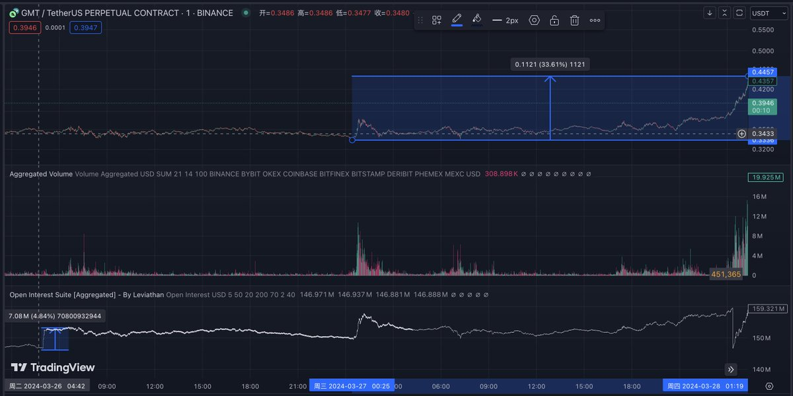
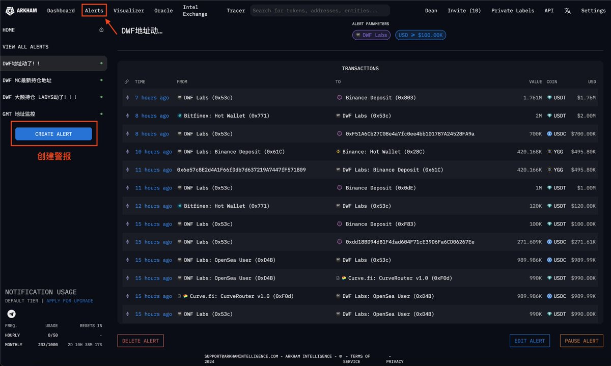
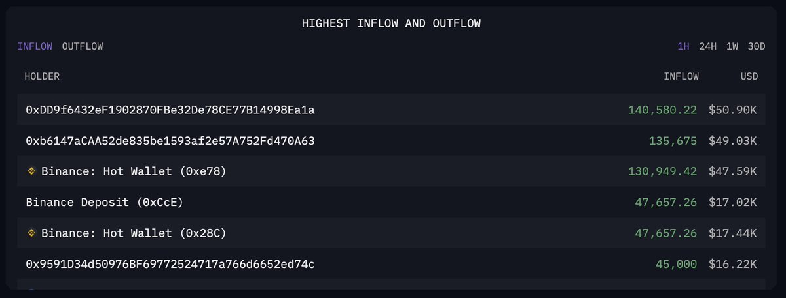

# 鏈上監控埋伏策略：GMT 鯨魚持倉分析與交易決策

> **來源**: [@deankepler](https://x.com/deankepler/status/1773926044653015052) | [原文連結](https://etherscan.io/token/0xe3c408BD53c31C085a1746AF401A4042954ff740?a=0xc7e73afcda8f00525dab82b76433806790501c77)
>
> **日期**: Sat Mar 30 04:11:41 +0000 2024
>
> **標籤**: `鯨魚監控` `合約持倉` `埋伏策略`

---

> **來源**: [@deankepler](https://twitter.com/deankepler)  
> **日期**: 2024-01-26  
> **標籤**: `鏈上監控` `鯨魚追蹤` `GMT` `合約持倉` `Arkham`

---

## 策略概述

分享一個鏈上監控的埋伏策略，經常用這個策略實現盈利，目前 GMT 截止 26 號買入已經實現盈利 28 個點。

## 第一步：篩選高度控盤幣種

通常會先用 TradingView 檢測幣安的幣種合約持倉是否發生變化（Coinglass 和 Coinank 都有類似的功能可以自己設置警報），或者是透過 LookOnChain 監控巨鯨正在購買的幣。

**目的**：篩選目前可能高度控盤的幣種，爆拉的可能性會更大。

### GMT 案例發現

在 26 號的時候透過 TradingView 的監控看到合約持倉量有一波爆拉，但是幣價沒有什麼波動，這時候就將 GMT 定為重點觀察的幣種之一。

圖中最下面一行是合約持倉量的變化，可以看到在 26 號下午四點持倉量暴漲但價格沒有波動。

## 第二步：監控大額建倉地址

將 GMT 輸入到 Arkham 觀察最近大額買入的地址的持幣情況，看到最近 24 小時和最近七天都有大額建倉的地址，並將其地址監控了起來。後續發現這幾個大額建倉的在最近 24 小時內一直買入、囤積。

### Arkham Alert 功能設置

地址的監控警報可以使用 Arkham 的 Alert 功能，將目標監控的地址直接輸入，地址只要有 transaction 就會直接轉發到你的 Telegram 或郵箱，都是免費的很好用。

## 第三步：分析鯨魚提幣行為

除此之外還發現了一個地址在 25 號的時候 20 分鐘從幣安提出了 1,200 萬美金的 GMT。

截止買入的時候，巨鯨那兩天從交易所提幣的總量已經超過當時幣安熱錢包的數量了。

## 交易決策邏輯

**核心判斷**：短期內這些巨鯨不會允許幣價下跌，由此推斷此時買入的盈虧比很高。

和幾個小夥伴商量後，倉位就打進去了。

## 策略要點總結

| 步驟 | 工具 | 目的 |
|------|------|------|
| 1. 持倉異常偵測 | TradingView / Coinglass / Coinank | 發現持倉量暴增但價格未動的幣種 |
| 2. 鯨魚地址追蹤 | Arkham / LookOnChain | 確認大額建倉行為持續發生 |
| 3. 提幣量分析 | Arkham | 驗證鯨魚囤積意圖（提幣量 > 交易所熱錢包） |
| 4. 風險評估 | - | 判斷鯨魚短期不會允許幣價下跌 |

## 關鍵指標

- **持倉量變化**：合約持倉量暴增但價格未動
- **鯨魚行為**：24 小時內持續大額建倉
- **提幣規模**：提幣總量超過交易所熱錢包存量
- **時間窗口**：發現異常後的短期內（1-2 天）進場
