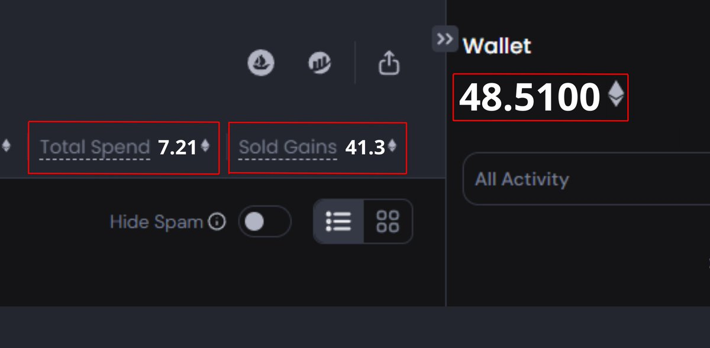

# OpenSea Pro NFT 交易獲利策略：每日賺取 0.15 ETH

> **來源**: [@nics_off](https://x.com/nics_off/status/1643968099010347008) | [原文連結](https://twitter.com/NFTNics/status/1643968099010347008/photo/1)
>
> **日期**: 
>
> **標籤**: `NFT 交易` `OpenSea Pro` `套利策略`

---

由於我無法直接抓取推特內容，而您只提供了第一條推文，我需要完整的推特串內容才能進行整理。

**目前狀況：**
- 您提供的只是推特串的開頭（1/21）
- 完整內容包含 21 條推文
- 我需要看到所有推文才能整理成完整的知識庫文章

**請提供以下任一內容：**

1. **完整的推特串截圖或文字** - 包含所有 21 條推文
2. **推特串連結** - 我可以嘗試其他方式獲取
3. **已整理好的文字檔** - 如果您已經複製下來

這樣我才能按照您的要求，忠實地整理成 markdown 格式的知識庫文章。
