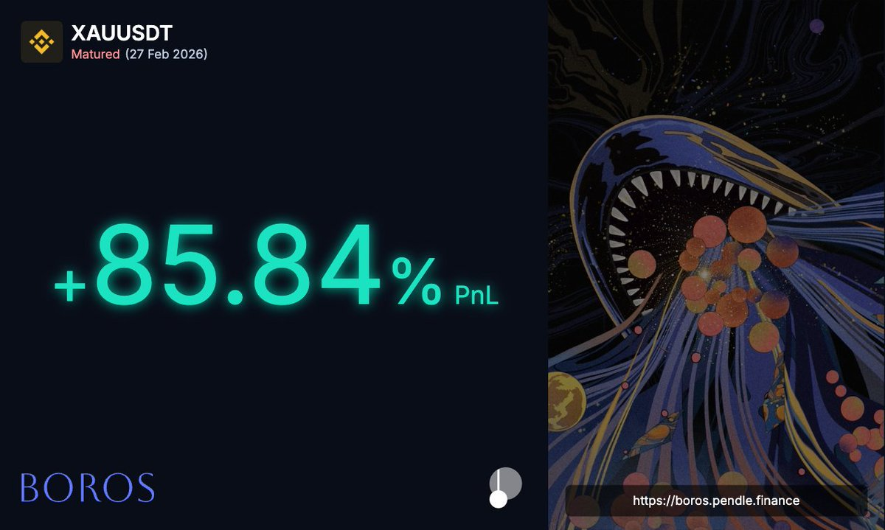

# Boros 金銀合約指數凍結資金費套利策略

> **來源**: [@Billy0xFF](https://x.com/Billy0xFF/status/2028293949954437507) | [原文連結](https://twitter.com/Billy0xFF/status/2028293949954437507/photo/1)
>
> **日期**: Mon Mar 02 02:18:56 +0000 2026
>
> **標籤**: `期貨套利` `資金費率` `無風險套利`

---

## Boros 金銀合約策略概述

Boros 金銀合約在頭兩週提供了無風險暴賺 100% 的機會：利用「指數凍結」的資金費降維打擊策略。

## 市場背景

如今熊市套利機會大大減少，這個策略因為流動性的稀缺而容量較小。作者寫下這個復盤是為了拋磚引玉，給大家提供一些思路。

## 核心機制

策略的核心在於利用「指數凍結」特性來進行資金費套利，在 Boros 金銀合約上實現降維打擊的效果。
