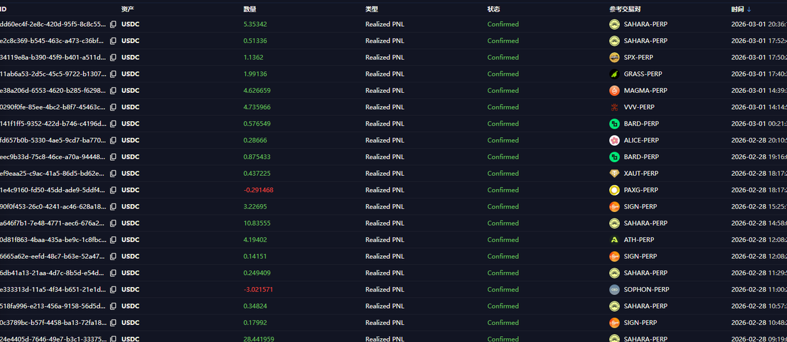

# Variational IO 交易系統開發與預測市場套利

> **來源**: [@0xdizai](https://x.com/0xdizai/status/2028097935427424585) | [原文連結](https://twitter.com/0xdizai/status/2028097935427424585/photo/1)
>
> **日期**: Sun Mar 01 13:20:02 +0000 2026
>
> **標籤**: `量化交易` `套利策略` `負成本交易`

---

> **來源**: [@0xdizai (迪仔)](https://twitter.com/0xdizai)
> **日期**: 2026-03-05

---

## Variational IO 交易系統開發進度

這週先把 var @variational_io 交易系統完成了。

基本上是每單都有盈利也有個別虧損。

缺點是盈利小只能透過頻率增加。

## 預測市場套利計畫

預測市場監控交易還沒弄好。

下週爭取做出來預測市場套利。

## 交易策略核心原則

無論玩哪個市場目標只有一個：**負成本交易拿分**。

如果你的策略成本高，應該快速優化。
