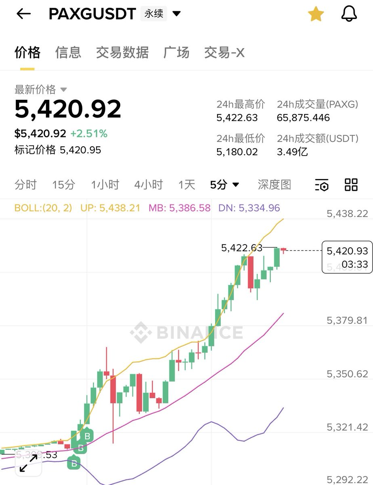
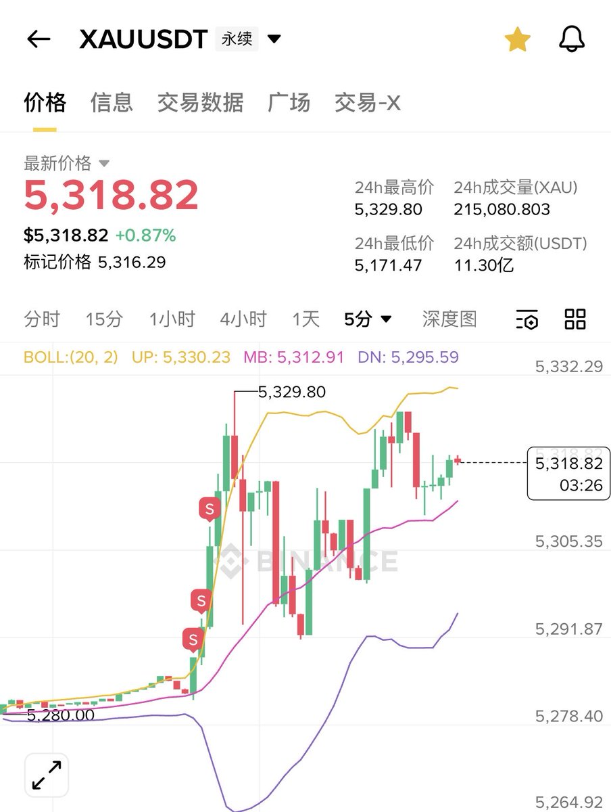

# 黃金期貨套利對沖：利用費率差異的週末套費率交易

> **來源**: [@devilcatbtc](https://x.com/devilcatbtc/status/2027671182754124245)
>
> **日期**: Sat Feb 28 09:04:16 +0000 2026
>
> **標籤**: `商品套利` `費率套利` `對沖策略`

---

> **來源**: [@devilcatbtc (茂茂大魔王)](https://x.com/devilcatbtc)
> **標籤**: `黃金期貨` `套利` `費率交易` `對沖策略` `PAXG`

---

## 週末黃金套費率策略

做週末的黃金套費率其實已經做了好幾週了，新出不久的東西總是會存在一些機會。

關於 XAU 和 XAG 的費率機制，簡單來說就是：
- **週末漲了就是正費率**
- **週末跌了就是負費率**

原因是指數價格保持不變。

## 實戰案例：利用地緣風險套利

下午看到打仗的消息，第一時間想到的是黃金會拉。為了保險起見，採取以下對沖策略：

- **做多 PAXG**（黃金代幣）
- **做空 XAU**（黃金期貨）

### 交易結果

- 當時的差價是 **30 刀**
- 現在已經擴大到 **100 刀**
- PAXG 是**負費率**，XAU 是**正費率**
- **又吃又拿**（既賺價差又收費率）

### 平倉時機

會在**週一早上開盤前提前平掉**，因為一開盤就沒溢價，也就沒費率了。
