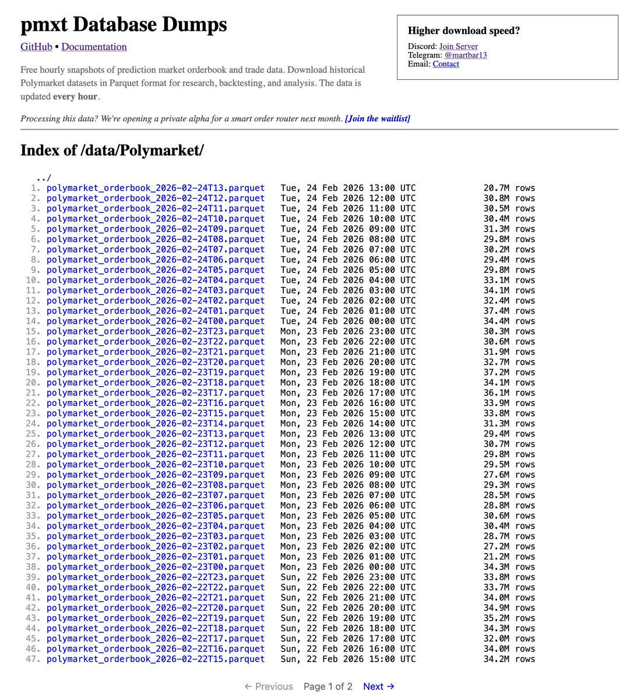

# Polymarket 完整訂單簿數據公開發布

> **來源**: [@martkiro](https://x.com/martkiro/status/2026327582627545548)
>
> **日期**: 
>
> **標籤**: `訂單簿數據` `量化分析` `預測市場`

---

## 數據發布公告

作者發布了來自 Polymarket 的完整訂單簿數據轉儲（data dump）。

## 數據特性

這些數據具有最大粒度，完全沒有任何過濾。每一個訂單簿變化和交易都被保存下來，涵蓋所有市場。

## 更新與規模

- **更新頻率**：每小時更新一次
- **單次快照**：包含約 3000 萬行數據
- **檔案格式**：以 parquet 檔案格式下載
- **檔案大小**：每個檔案約 500MB-1GB
- **總數據量**：目前已超過 20 億行，且快速增長中

## 未來計劃

這只是三部分計劃中的第一部分。即將推出更大規模的數據轉儲，將包含以下平台：
- Kalshi (@Kalshi)
- opinionlabsxyz (@opinionlabsxyz)  
- trylimitless (@trylimitless)
等其他平台。

## 收集動機

作者開始收集這些數據的原因是發現無法從 Dome API 獲得完整數據。Dome API 的歷史訂單簿數據經過過濾，限制了其實用性。此外，隨著收購事件的發生，Dome 是否會繼續營運存在很大的不確定性。
