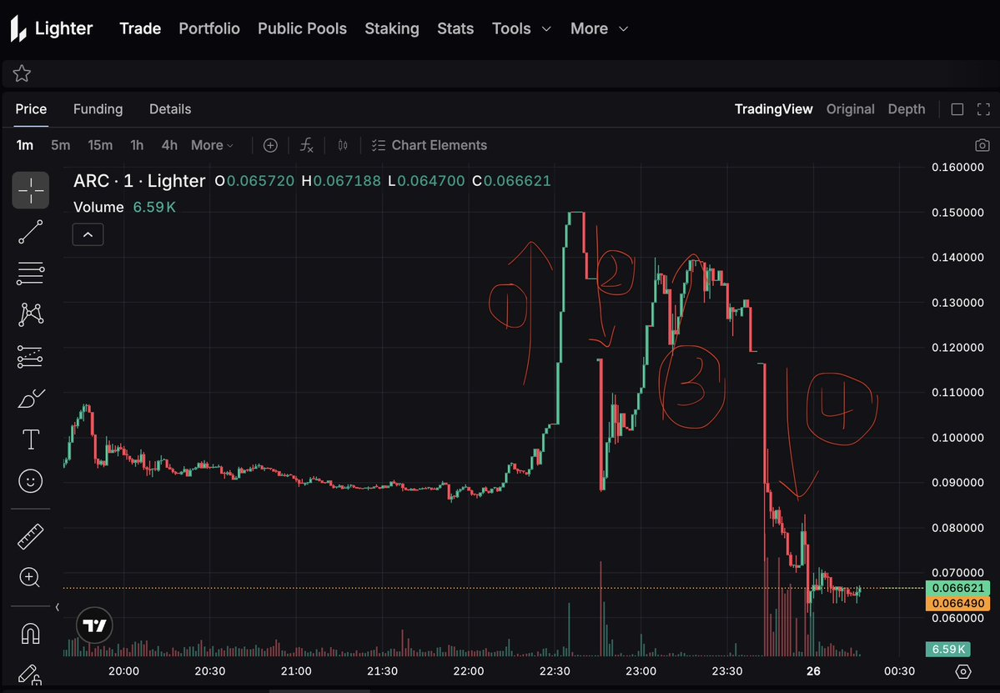

# Lighter ARC 事件：LLP 攻擊與 ADL 清算實錄

> **來源**: [@yourQuantGuy](https://x.com/yourQuantGuy/status/2026801322146578605)
>
> **日期**: Wed Feb 25 23:27:46 +0000 2026
>
> **標籤**: `市場微觀結構` `自動清算機制` `流動性風險`

---

## 事件背景

該帳戶在 Lighter 上開倉了約 2 億個 ARC 的看多合約，價值約 $2400 萬，並且還在不停地 TWAP 開倉，當時浮盈 $500 萬，每天需要付 $95 萬的資金費。

## 事件時間線

### 1. 初始大倉位建立

該帳戶在 Lighter 上開倉了約 2 億個 ARC 的看多合約，價值約 $2400 萬。

### 2. Lighter 加入 OI 限制（第一次）

Lighter 為了控制局面，給 ARC 增加了 $40M 的 OI 限制，所以所有人只能平倉，不能開倉。由於幾乎所有的多倉都是這個帳戶持有，所以沒有賣單，只有開空平倉的買單，導致短時間內價格迅速上升（圖中標註 1 的地方）。

### 3. 取消 OI 限制

價格迅速上升後，Lighter 團隊不知道為什麼，又取消了 OI 的限制，有人可以進來開空後，價格隨即迅速下跌（圖中標註 2 的地方）。

### 4. 再次加入 OI 限制（第二次）

沒過多久，OI 的限制又加上了🤣，由於沒有賣單只有買單，價格又開始拉升（圖中標註 3 的地方）。

### 5. 調整資金費率導致清算

Lighter 只能使出絕招，把資金費率從每小時 0.5% 調整到了每小時 2%，於是價格終於開始下跌，該帳戶爆倉被清算（圖中標註 4 的地方）。

### 6. 清算後倉位轉移

該帳戶被清算後，所有倉位還是被移到 LLP。

### 7. ADL 機制故障與停機

這時候應該啟動 ADL 機制了，但是好像出了什麼問題了，於是 Lighter 直接拔了網線，關了服務器。

### 8. ADL 執行與收尾

服務器再次啟動後，ADL 開始了，所有空倉都被 ADL 了，OI 從 $4000 萬回到了 $40 萬。

## 親歷者體驗

作者表示：「以後再也不玩這種了⋯⋯忙活半天，最後因為被 ADL 的價差，只賺了 2000u 不到。」
