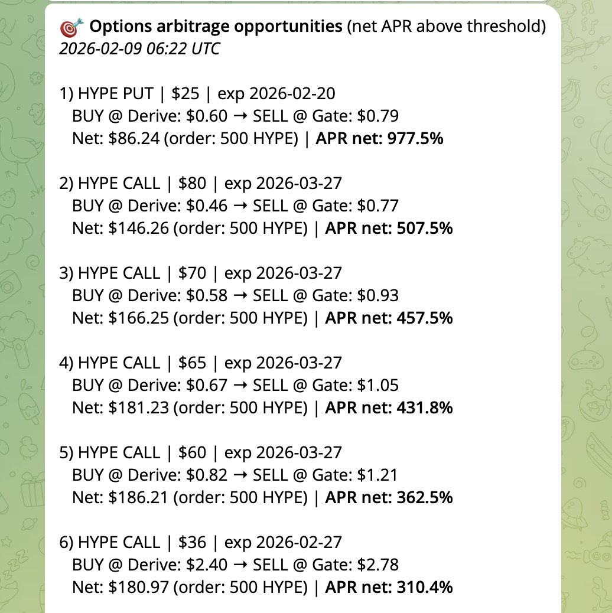
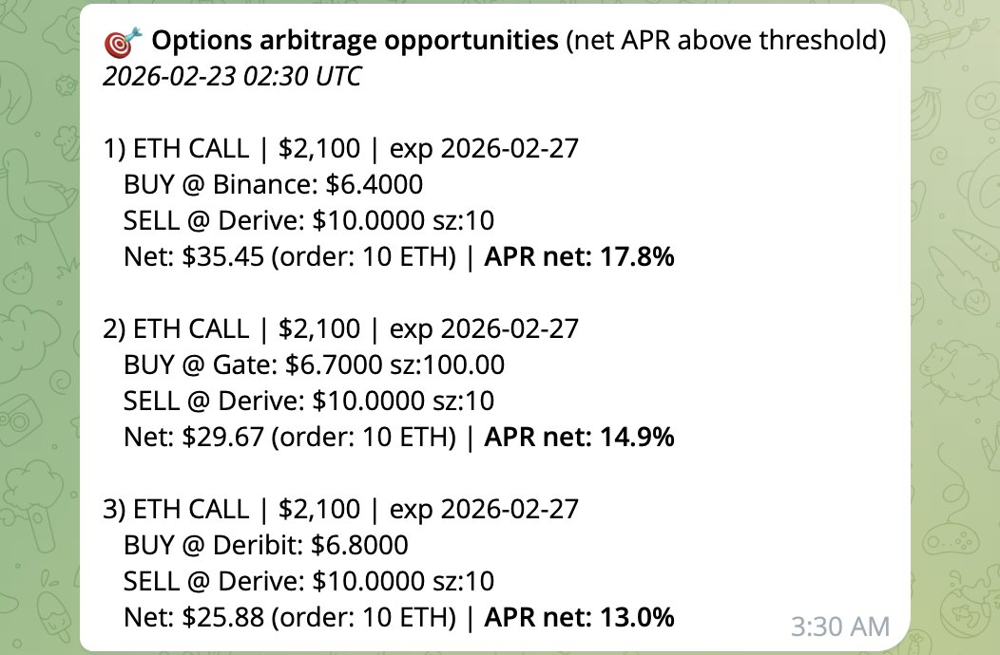

# Hype 期權跨交易所價差套利：年化 1000% 的機會與貪心的代價

> **來源**: [@yourQuantGuy](https://x.com/yourQuantGuy/status/2026599703580692767)
>
> **日期**: Wed Feb 25 10:06:36 +0000 2026
>
> **標籤**: `期權套利` `跨交易所套利` `市場微觀結構`

---

## 發現套利機會

分享一個 Alpha，這個月我「只」擼了幾萬u

事情是這樣的，我前段時間不是開始定投 Hype 了嗎？

然後我就想著能不能通過期權再增加點收益，一點點也行

就去看了一下各個平台的價格和流動性，結果，這價差大到嚇人，按照年化算，能有 1000% 😳

而且不是什麼複雜的期權結構，就是在一個交易所買一手期權，再去另一個交易所賣一手同樣行權價和到期日的期權。

## 試水與擴大

我擔心有什麼坑，於是只買了一點點試水。幾天後到期了，居然一點坑都沒有。

於是我開始下單買更多，但是開始貪心了，只想買那些到期日近的，變現快的，放棄了那些遠期但套利收益其實更高的期權。

## 機會消失的教訓

結果還不到一週，套利的機會就沒了，明明如果大掃貨的話能暴富的，最後卻「只」擼了幾萬u 🥲

雖然這個 alpha 過期了，但是有心的朋友還是可以監控一下，偶爾還是有套利的機會可以小額賺個20%左右的年化，尤其是如果你用統一保證金且帳戶裡本來就有資金，那就是順便賺的了。
