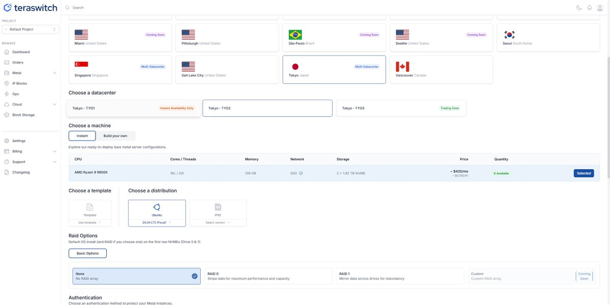

# @dan326714 哥， 买这个 https://t.co/QcoCy6UUkc

> **來源**: [@0x10240](https://x.com/0x10240/status/2006957489812856933) | [原文連結](https://twitter.com/0x10240/status/2006957489812856933/photo/1)
>
> **日期**: Fri Jan 02 05:15:27 +0000 2026
>
> **標籤**: 

---

根據你提供的資訊，這是一個來自 @0x10240 (x1024) 回覆給 @dan326714 的推文，內容只有一句話：「哥， 买这个」加上一個連結。

這個內容非常簡短，沒有實質的知識內容。這看起來只是一個簡單的推薦或提醒訊息，缺乏足夠的資訊來整理成知識庫文章。

**建議處理方式：**

1. **不建議收錄**：這則推文內容過於簡短，沒有提供足夠的知識或資訊價值
2. **如果連結很重要**：可以嘗試直接訪問推文中的連結內容，或許連結指向的內容才是真正值得整理的資訊
3. **補充上下文**：如果你知道這則推文的背景（例如推薦的是什麼產品/服務），可以提供更多資訊讓我幫你整理

你想要我：
- A) 跳過這則推文，不收錄到知識庫
- B) 提供更多上下文資訊讓我整理
- C) 嘗試查看推文中連結指向的內容

請告訴我你的選擇。
