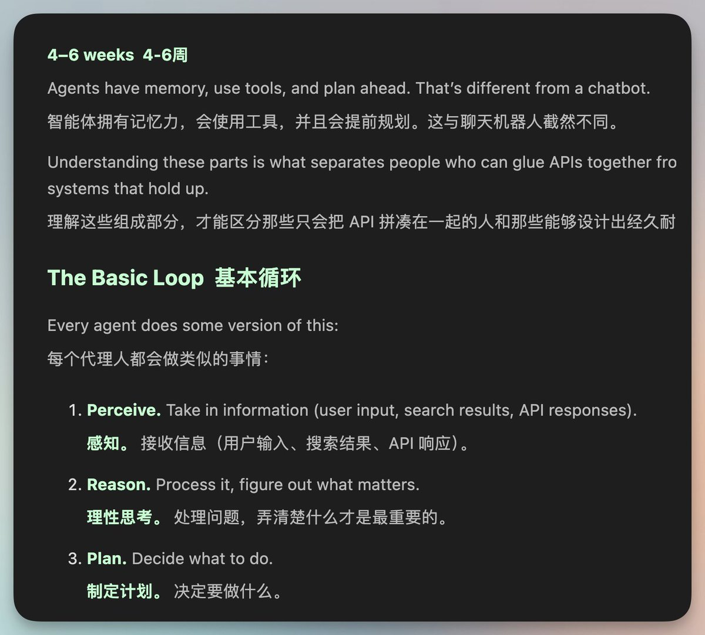

# 这大哥把自己学习AI知识的经验和资源写了一篇博客。

对我来说有点硬核，从数学尤其是线性代数等开始学

> **來源**: [@vista8](https://x.com/vista8/status/2009298339678797919)
>
> **日期**: 
>
> **標籤**: 

---

看起來這則內容只是一個推文摘要，並沒有包含完整的學習資源細節。這種情況下，我需要實際抓取原始博客內容才能整理成有價值的知識庫文章。

不過我注意到內容中提到「地址見評論」，但您沒有提供實際的 URL。我有幾個選項：

**選項 1：提供 URL 讓我抓取完整內容**
如果您能提供那篇博客的實際連結，我可以使用 agent-browser 抓取完整的學習計劃和資源列表，整理成完整的知識庫文章。

**選項 2：僅整理目前的摘要資訊**
如果只是要記錄這個發現，我可以將這則推文整理成簡短筆記：

---

> **來源**: [@vista8 (向阳乔木)](URL)  
> **日期**: YYYY-MM-DD  
> **標籤**: `AI學習` `學習資源` `課程規劃`

一位開發者分享了自己的 AI 學習經驗，並整理成完整的學習計劃博客文章。

## 學習路徑概覽

該學習計劃涵蓋 **6-9 個月**，採用系統化的學習路徑：

| 學習階段 | 主題領域 |
|---------|---------|
| 基礎數學 | 線性代數為主 |
| 機器學習 | 核心理論與實作 |
| 程式設計 | 實作能力培養 |
| Agent 開發 | 智能體應用 |

## 推薦資源

文章中提及的學習資源包括：

- **3Blue1Brown** - 視覺化數學教學
- **可汗學院** - 基礎數學課程
- 其他經過驗證的優質教材

## 適用對象

- 想要系統性學習 AI 知識的初學者
- 願意投入 6-9 個月時間深度學習
- 具備一定數學基礎或願意從頭學起

---

**您希望我：**
1. 提供完整博客 URL，讓我抓取完整內容並深度整理？
2. 就用目前這個簡短版本記錄？
