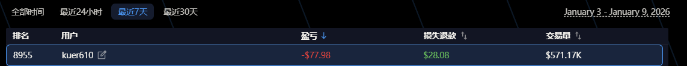

# @variational_io 这周V所分数有点懵，我分别做了
1.纯BTC，ETH无脑刷量 效率极

> **來源**: [@sofa667788](https://x.com/sofa667788/status/2009438234577863160)
>
> **日期**: Fri Jan 09 01:33:03 +0000 2026
>
> **標籤**: 

---

這篇內容是關於加密貨幣交易所積分刷分策略的實驗記錄，但內容過於簡短且缺乏詳細數據，主要是個人操作心得的零散筆記。建議處理方式如下:

## 建議處理方案

由於此內容：
- **缺乏系統性**：只列出實驗項目，無具體數據對比
- **結論模糊**：僅提到「基本確定哪個效率高」但未明確說明
- **資訊不完整**：提到有圖片但未提供，無法驗證實驗結果
- **實用價值有限**：對讀者缺乏可操作的洞察

### 兩個選項：

**選項 1：暫不收錄**  
等待更完整的資訊或後續補充數據時再整理

**選項 2：簡化收錄**  
如果您堅持要保存這則筆記，我可以整理成以下格式：

---

## V 所積分刷分策略實驗

作者在某週進行了多種刷分策略測試，實驗組包括：

| 策略編號 | 操作方式 | 初步結論 |
|---------|---------|----------|
| 1 | 純 BTC、ETH 無腦刷量 | 效率極低 |
| 2 | 大幣打底倉 + 單品種小幣刷量 | 未明確 |
| 3 | 單號單幣種小幣刷量（15 幣種 15 號） | 未明確 |
| 4 | 單小幣持倉不刷分（5 幣種 5 號） | 未明確 |
| 5 | 同幣種不同保證金測試（5000U vs 10000U） | 效果微乎其微 |

### 實驗結果

- 該週獲得約 500 分（未達每週 2000 分目標）
- 作者表示已確定高效率策略並開始使用腳本批量操作
- 具體哪種策略最優未在文中明確說明

### 限制

- 缺乏具體數據對比
- 未說明測試的交易所和具體規則
- 結論過於籠統，缺乏可複製性

---

**您希望如何處理這篇內容？**
